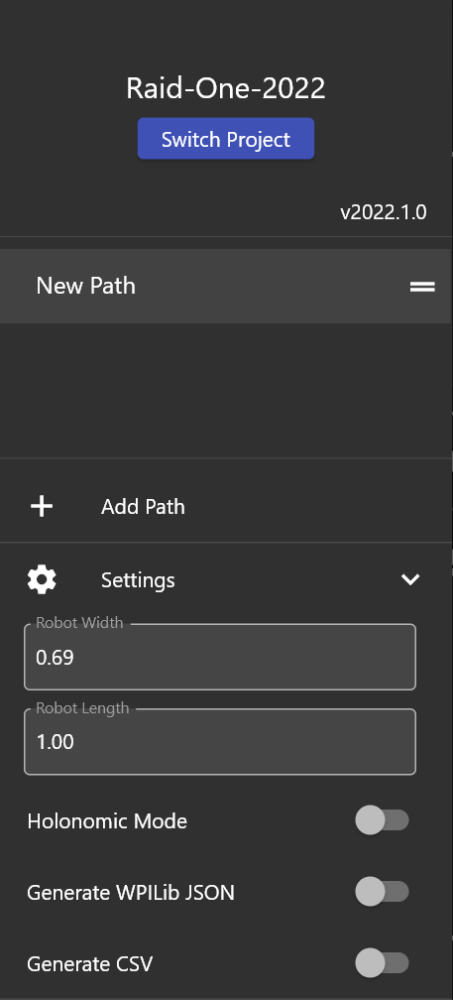
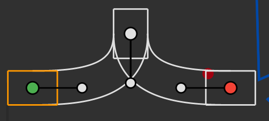
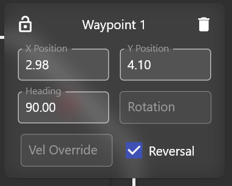

##################################
Making the Robot Move Autonomously
##################################

There are two periods in a match: Auton and Teleop. During the Auton period, the robot moves
autonomously. During the Teleop period, the robot moves according to the user's input.

Everything controlled during the auton period is through sequences which can be found here: 

.. figure:: ../images/sequence.PNG

Configuring Pathplanner
=======================

We use Pathplanner to generate trapezoidal motion profiles based on beizer curves. You can 
download Pathplanner `here <https://github.com/mjansen4857/pathplanner/releases>`_.

To start pathing with Pathplanner, you need to make sure that Pathplanner knows where the root
of your project is by clicking this button: 

.. figure:: ../images/pathplanner/pathplanner_switch_project.PNG

After you have done this, configure Pathplanner's settings by going over here: 

.. note::
    Always remember to stick with meters for everything (ex. length = m, velocity = m/s, etc)

Now that Pathplanner is configured, you can start making custom paths. Here is a sample path: 

The green point represents the start, the red point represents the end, and the white point(s) 
represents the waypoints. When configuring waypoints, you can make precise configurations by 
altering these values: 

* **X Position** - The x position of the waypoint.
* **Y Position** - The y position of the waypoint.
* **Heading** - The heading of the waypoint.
* **Vel Override** - The velocity override of the waypoint (basically you can set your own 
  desired velocity when the robot reaches that waypoint).
* **Reversal** - Whether or not the robot should reverse when it reaches that waypoint.

Making the Chassis Follow the Path
==================================

Now, lets make the robot follow the path. For the sake of demonstration purposes, I will be 
using TestSequence.java to follow the path. 

First, you must load the path into the sequence with this: 

.. code-block:: java

    private static final Trajectory MY_PATH = PathPlanner.loadPath("PATH_NAME", AutoConstants.MAX_VEL, AutoConstants.MAX_ACCEL);

.. note::
    Change PATH_NAME to the name of the path you want to load.

Next, you need to make the chassis follow the path like this: 

.. code-block:: java
    :emphasize-lines: 4
    
    @Override
    public void sequence() {
        addAction(new SeriesAction(Arrays.asList(
            new DrivePath(MY_PATH, true)
        )));
    }

* **addAction** - This is the method that adds the action to the sequence. 
* **SeriesAction** - This is the action allows you to string different actions together.
  though in this case, we only have one action, the DrivePath.
* **DrivePath** - This is the action that actually drives the robot. The first argument is the 
  path you want to follow. The second argument is whether or not the path is the first path. 
  this is necessary as it determines whether or not the robot should reset its odometry. 

.. note::
    The pathing assumes that everything is global which means if your first path goes from 
    point A to point B, your second path MUST start from point B. 

Moving the Robot
================

After deploying the code, go to the "Main" tab in shuffleboard and select Test Sequence (or 
whatever you named your sequence). When you press ENABLE, the robot will follow the path. 

.. note::
    You must shout "ENABLED" loud and clear when you enable the robot. If you do not, consequences
    will follow. This is for your wellbeing and safety.